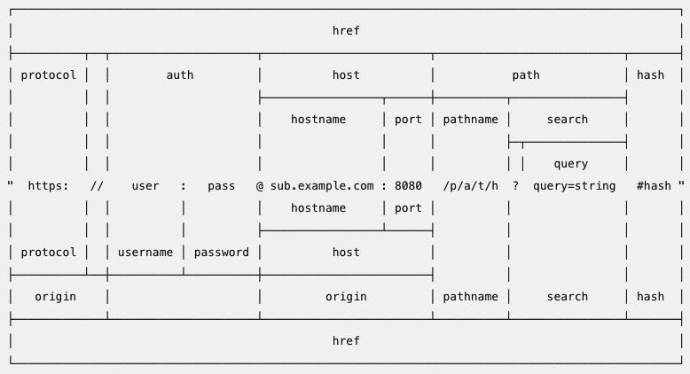

- {} = require() -> module.export
- import {} from ''; -> export.default 파일 명 (import가 최신)

- module.exports === exports === {}
- 함수를 넣으면 module.exports !== exports === {}

## 노드

- 싱글 쓰레드

## global : 노드의 전역 객체 (브라우저 : window)

- global 생략 가능
- golbal 속성에 값을 대입하면 다른 파일에서도 사용 가능

## 타이머 메서드

- set
- setTimeout((){}, 1000) : 1초 뒤 실행 (콜백 함수, 밀리초) -> 변수에 담으면 취소가능
- setInterval(콜백 함수, 밀리초) : 변수에다가 담아줘야함. -> 반복 작동을 하는데 clearInterval(변수 명) 취소를 함
- setImmediate(콜백함수) : 바로 실행함. 동시에 여러개를 실행할 때 사용 이것도 취소가 가능함
- 왜냐면 호출 스택 -> 백그라운드 -> 테스큐 -> 호출스택 이렇게 흘러서 실행 전에 취소를 하면 취소가 된다!

## **filename, **dirname

**filename : 현재 파일 경로
**dirname : 현재 폴더(디렉터리) 경로

## this

- 전역일 때 module.exports
- 함수 안에서는 global 자바스크립트랑 같음.

## require

- require 되믄 캐싱이 된다. cache 안에 저장을 해둠
- require.main은 노드 실행 시 첫 모듈을 가리킴

## 순환 참조

- dep1이 dep2를 참조하고 dep2가 dep1을 참조하는 경우
- 순환 참조되는 경우는 피하는게 좋음

## process

- 현재 실행 중인 노드 프로세스에 대한 정보를 담고 있다.
- process.env : 시스템 환경 변수들이 들어있는 객체
- process.nextTick : 이벤트 루프가 다른 콜백 함수들 보다 nextTick의 콜백 함수를 우선적으로 처리함
- process.exit : 노드 종료

## os

- 운영체제의 정보를 담고 있음
- 모듈은 require로 가져옴 (require('os'))
- [os 문서](https://nodejs.org/dist/latest-v16.x/docs/api/os.html)

> os.arch(): process.arch와 동일<br>
> os.platform(): process.platform과 동일<br>
> os.type(): 운영체제의 종류를 보여줌<br>
> os.uptime(): 운영체제 부팅 이후 흐른 시간(초)을 보여줌<br>
> process.uptime()은 노드의 실행 시간<br>
> os.hostname(): 컴퓨터의 이름을 보여줌<br>
> os.release(): 운영체제의 버전을 보여줌<br>
> os.homedir(): 홈 디렉터리 경로를 보여줌<br>
> os.tmpdir(): 임시 파일 저장 경로를 보여줌<br>
> os.cpus(): 컴퓨터의 코어 정보를 보여줌<br>
> os.freemem(): 사용 가능한 메모리(RAM)를 보여줌<br>
> os.totalmem(): 전체 메모리 용량을 보여줌<br>

## path

- 폴더와 파일의 경로를 쉽게 조작하도록 도와주는 모듈
- 운영체제별로 경로 구분자가 다름! -> 이것을 처리해주는 것이 path다
- const path = require('path); 로 사용함
- [path 문서](https://nodejs.org/dist/latest-v16.x/docs/api/path.html)

> path.sep: 경로의 구분자(Windows는 \, POSIX는 /) <br>
> path.delimiter: 환경 변수의 구분자
> process.env.PATH를 입력하면 여러 개의 경로가 이 구분자로 구분되어 있음
> Windows는 세미콜론(;), POSIX는 콜론(:)<br>
> path.dirname(경로): 파일이 위치한 폴더 경로를 보여줌<br>
> path.extname(경로): 파일의 확장자를 보여줌<br>
> path.basename(경로, 확장자): 파일의 이름(확장자 포함)을 보여줌 파일의 이름만 표시하고 싶다면 basename의 두 번째 인자로 파일의 확장자를 넣어주면 됨<br>
> path.parse(경로): 파일 경로를 root, dir, base, ext, name으로 분리<br>
> path.format(객체): path.parse()한 객체를 파일 경로로 합침<br>
> path.normalize(경로): /나 \를 실수로 여러 번 사용했거나 혼용했을 때 정상적인 경로로 변환<br>
> path.isAbsolute(경로): 파일의 경로가 절대경로인지 상대경로인지 true나 false로 반환<br>
> path.relative(기준경로, 비교경로): 경로를 두 개 넣으면 첫 번째 경로에서 두 번째 경로로 가는 방법을 알려줌<br>
> path.join(경로, .. .): 여러 인자를 넣으면 하나의 경로로 합쳐줌 상대경로인 ..(부모 디렉터리)과 .(현 위치)도 알아서 처리<br>
> path.resolve(경로, .. .): path.join()과 비슷하지만 차이가 있습니다.

## url 모듈

- 인터넷 주소를 쉽게 조작하도록 도와주는 모듈
- url 처리에 크게 두 가지 방식이 있음(기존 노드 방식 vs WHATWG 방식
- 아래 그림에서 가운데 주소를 기준으로 위쪽은 기존 노드 방식, 아래쪽은 WHATWG 방식
  
- [url 문서](https://nodejs.org/dist/latest-v16.x/docs/api/url.html)

## crypto

- 단방향 암호화
- 양방향 암호화 aes
- 비대칭 암호화 rsa
- [crypto 문서](https://nodejs.org/dist/latest-v16.x/docs/api/crypto.html)
- 보통 알고리즘이 뚤려서 털리는게 아니고 사람 실수로 뚤리는 것!

## util

- 각종 편의 기능을 모아둔 모듈
- deprecated, promisify가 자주 쓰임
- util.deprecate: 함수가 deprecated 처리되었음
- util.promisify: 콜백 패턴을 프로미스 패턴으로 바꿔줌
  (단 콜백이 (error, data) => {} 형식잉어야 함.)

## worker_threads

- 노드에서 멀티 스레드 방식으로 작업할 수 있음.
- isMainThread: 현재 코드가 메인 스레드에서 실행되는지, 워커 스레드에서 실행되는지 구분
- [worker_threads 문서](https://nodejs.org/dist/latest-v16.x/docs/api/worker_threads.html)
- 워커 스레드를 늘린다고 해도 그만큼 빨라지는게 아니다.
- 노드로는 멀티스레드는 쓰지 않는 것이 좋음!!
- 다른 언어로 하는 범 -> child_process가 있음(다른 언어를 배우는게 아님)

## child_process

- 노드에서 다른 프로그램을 실행하고 싶거나 명령어를 수행하고 싶을 때 사용
- 현재 노드 프로세스 외에 새로운 프로세스를 띄워서 명령을 수행함.
- 출력 값을 직접 받아와야 함.

## fs

- 파일 시스템에 접근하는 모듈 - 사용할 때 조심해야 함!!
- 파일/폴더 생성, 삭제, 읽기, 쓰기 가능
- 웹 브라우저에서는 제한적이었으나 노드는 권한을 가지고 있음
- fs는 콜백임
- fs를 프로미스로 사용하고 싶을 떄 require(‘fs’).promises; 로 선언하면 됨
- 노드는 대부분의 내장 모듈 메서드를 비동기 방식으로 처리
  - 비동기는 코드의 순서와 실행 순서가 일치하지 않는 것을 의미
  - 일부는 동기 방식으로 사용 가능
- 비동기는 콜백이 발생함 이를 사용하여 순서 유지!! (콜백 지옥!!)-> promise로 사용하자 ㅋㅋ
- 동기를 사용할 때에 주의하자!
- [fs 문서](https://nodejs.org/dist/latest-v16.x/docs/api/fs.html)

## 버퍼와 스트림

- 버퍼 : 일정한 크기로 모아두는 데이터
  - 일정한 크기가 되면 한 번에 처리

```js
const buffer = Buffer.from("저를 버퍼로 바꿔보세요");
console.log("from():", buffer);
console.log("length:", buffer.length);
console.log("toString():", buffer.toString());

const array = [
  Buffer.from("띄엄 "),
  Buffer.from("띄엄 "),
  Buffer.from("띄어쓰기"),
];
const buffer2 = Buffer.concat(array);
console.log("concat():", buffer2.toString());

const buffer3 = Buffer.alloc(5);
console.log("alloc():", buffer3);
```

- 스트림 : 데이터의 흐름
  - 일정한 크기로 나눠서 여러 번에 걸쳐서 처리

```js
const fs = require("fs");

const readStream = fs.createReadStream("./readme3.txt", { highWaterMark: 16 });
const data = [];

readStream.on("data", (chunk) => {
  data.push(chunk);
  console.log("data :", chunk, chunk.length);
});

readStream.on("end", () => {
  console.log("end :", Buffer.concat(data).toString());
});

readStream.on("error", (err) => {
  console.log("error :", err);
});
```

```js
const fs = require("fs");

const writeStream = fs.createWriteStream("./writeme2.txt");
writeStream.on("finish", () => {
  console.log("파일 쓰기 완료");
});

writeStream.write("이 글을 씁니다.\n");
writeStream.write("한 번 더 씁니다.");
writeStream.end();
```

## pipe

- pipe로 여러개의 스트림을 이을 수 있음.

## 스레드 풀

- fs, crypto, zlib 모듈의 메서드를 실행할 때는 백그라운드에서 동시에 실행됨.
- 노드는 백그라운드에서 돌아가는 작업을 4개 씩 동시에 돌림
- UV_THREADPOOL_SIZE=개수 로 조절 가능
- 윈도우는 앞에 'SET ' 을 붙혀줘야함.

## events

- 커스텀 이벤트를 만들 수 있음.

## 에러 처리

- 기본적으로 try catch문으로 예외 처리
- 노드 비동기 메서드의 에러는 따로 처리하지 않아도 됨 (콜백 함수에서 에러 객체 제공)
- 프로미스의 에러는 따로 처리하지 않아도 됨
- 예측 불가능한 에러 처리하기 (아래)
  > ```js
  > process.on("uncaughtException", (err) => {
  >   console.error("예기치 못한 에러", err);
  > });
  >
  > setInterval(() => {
  >   throw new Error("서버를 고장내주마!");
  > }, 1000);
  >
  > setTimeout(() => {
  >   console.log("실행됩니다");
  > }, 2000);
  > ```
  >
  > - 콜백 함수의 동작이 보장되지 않음
  > - 따라서 복구 작업용으로 쓰는 것은 부적합
  > - 에러 내용 기록 용으로만 쓰는게 좋음!
